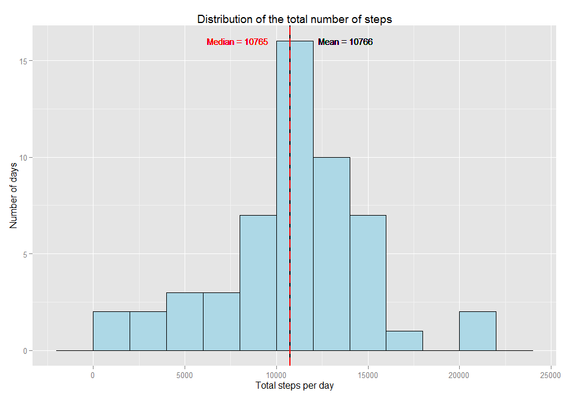
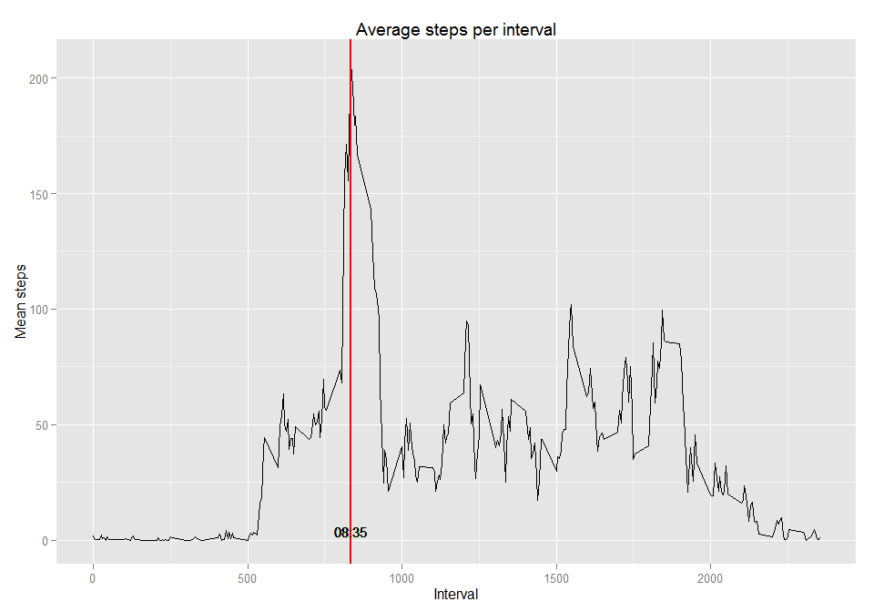
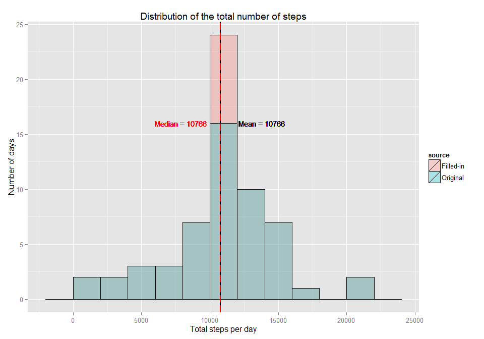
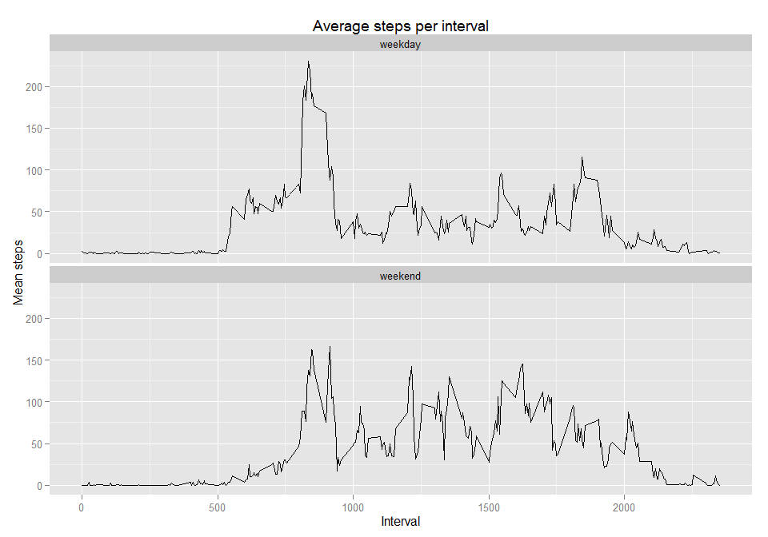

# Reproducible Research: Peer Assessment 1


## Loading and preprocessing the data


```r
file <- unzip("activity.zip")
activity <- read.csv(file, stringsAsFactors = FALSE)
activity$date <- as.Date(activity$date)

# load required libraries
library(dplyr)
```

```
## 
## Attaching package: 'dplyr'
## 
## The following objects are masked from 'package:stats':
## 
##     filter, lag
## 
## The following objects are masked from 'package:base':
## 
##     intersect, setdiff, setequal, union
```

```r
library(ggplot2)
library(xtable)
library(lubridate)
```


## What is mean total number of steps taken per day?

The values for mean and median are:


```r
dailySteps <- activity %>% group_by(date) %>% summarize(totalSteps = sum(steps))
central <- data.frame(Measure = c("Mean", "Median"),
                  Value = round(c(mean(dailySteps$totalSteps, na.rm = TRUE),
                                  median(dailySteps$totalSteps, na.rm = TRUE)),
                                0))

xt <- xtable(central)
print(xt, type = "html")
```

<!-- html table generated in R 3.2.1 by xtable 1.7-4 package -->
<!-- Sun Aug 16 15:38:01 2015 -->
<table border=1>
<tr> <th>  </th> <th> Measure </th> <th> Value </th>  </tr>
  <tr> <td align="right"> 1 </td> <td> Mean </td> <td align="right"> 10766.00 </td> </tr>
  <tr> <td align="right"> 2 </td> <td> Median </td> <td align="right"> 10765.00 </td> </tr>
   </table>

The histogram lets us to figure out the distribution


```r
ggplot(dailySteps, aes(x = totalSteps)) +
# add histogram for daily total steps
geom_histogram(fill = "lightblue", binwidth = 2000, aes(y = ..count..), colour = "black") +
# add vertical line for mean
geom_vline(xintercept = central$Value[1], color = "black", size = 1) +
geom_text(aes(13800, 16, label=paste0(central$Measure[1], " = ", central$Value[1])), color = "black", size=4) +
# add vertical line for median
geom_vline(xintercept = central$Value[2], color = "red", linetype = "longdash", size = 1) +
geom_text(aes(7900, 16, label=paste0(central$Measure[2], " = ", central$Value[2])), color = "red", size=4) +
# add labels
labs(x = "Total steps per day", y = "Number of days", title="Distribution of the total number of steps") 
```

 


## What is the average daily activity pattern?


```r
intervalSteps <- activity %>% group_by(interval) %>% summarize(mean = mean(steps, na.rm=TRUE))
maxStepsInterval <- intervalSteps$interval[which.max(intervalSteps$mean)]
maxStepsTime <- sprintf("%02d:%02d", maxStepsInterval %/% 100, maxStepsInterval %% 100)
```

The next graphic shows the average number of steps per interval. There is an absolute maximum at 08:35:


```r
ggplot(intervalSteps, aes(x = interval, y = mean)) +
# add line for mean steps per interval
geom_line(colour="black", size = 0.5) +
# add vertical line for max
geom_vline(xintercept = maxStepsInterval, color = "red", size = 1) +
geom_text(aes(maxStepsInterval, 4, label = maxStepsTime), color="black", size=4) +
# add labels
labs(x = "Interval", y = "Mean steps", title="Average steps per interval") 
```

 


## Imputing missing values

There are 2304 rows in the dataset, from a total of 17568, without a value for the number of steps. These missing values may introduce bias into some calculations or summaries of the data, so we will fill them with a value which can be acceptable.

We will use the mean of the values in the interval to fill the missing values.


```r
activity2 <- activity
activity2$steps <- mapply(function(steps, meanSteps) {if (is.na(steps)) meanSteps else steps},
                         activity$steps,
                         intervalSteps$mean)
```

In order to analyze the influence of this filling strategy, we calculate the mean and the median of the improved dataset to compare it with the original one. 


```r
dailySteps2 <- activity2 %>% group_by(date) %>% summarize(totalSteps = sum(steps))
central2 <- data.frame(Measure = c("Mean", "Median"),
                       Original.Value = central$Value,
                       New.Value = round(c(mean(dailySteps2$totalSteps, na.rm = TRUE),
                                           median(dailySteps2$totalSteps, na.rm = TRUE)),
                                         0))

xt2 <- xtable(central2)
print(xt2, type = "html")
```

<!-- html table generated in R 3.2.1 by xtable 1.7-4 package -->
<!-- Sun Aug 16 15:38:03 2015 -->
<table border=1>
<tr> <th>  </th> <th> Measure </th> <th> Original.Value </th> <th> New.Value </th>  </tr>
  <tr> <td align="right"> 1 </td> <td> Mean </td> <td align="right"> 10766.00 </td> <td align="right"> 10766.00 </td> </tr>
  <tr> <td align="right"> 2 </td> <td> Median </td> <td align="right"> 10765.00 </td> <td align="right"> 10766.00 </td> </tr>
   </table>

So the mean is the same and the median is slightly higher. Now mean and median are the same.

The following histogram compares the original data and the data with the filled-in missing values, where we can observe that both are exactly the same except in the bar around the mean, which is taller now.


```r
dailySteps2$source <- "Filled-in"
dailySteps$source <- "Original"
dailyStepsUnion <- bind_rows(dailySteps2, dailySteps)
dailyStepsUnion$source <- factor(dailyStepsUnion$source)

ggplot(dailyStepsUnion, aes(x = totalSteps, group = source)) +
# add histogram for daily total steps
geom_histogram(position="identity", alpha = 0.3, binwidth = 2000, aes(y = ..count.., fill = source), colour = "black") +
# add vertical line for mean
geom_vline(xintercept = central2$New.Value[1], color = "black", size = 1) +
geom_text(aes(13800, 16, label=paste0(central2$Measure[1], " = ", central2$New.Value[1])), color = "black", size=4) +
# add vertical line for median
geom_vline(xintercept = central2$New.Value[2], color = "red", linetype = "longdash", size = 1) +
geom_text(aes(7900, 16, label=paste0(central2$Measure[2], " = ", central2$New.Value[2])), color = "red", size=4) +
# add labels
labs(x = "Total steps per day", y = "Number of days", title="Distribution of the total number of steps") 
```

 


## Are there differences in activity patterns between weekdays and weekends?

To analyze the differences, we create a new factor variable in the dataset with two levels - "weekday" and "weekend" indicating whether a given date is a weekday or weekend day.


```r
dayTypeFactor <- factor(c("weekday", "weekend"))
typeWeekday <- function (day) { if (wday(day) %in% 2:6) dayTypeFactor[1] else dayTypeFactor[2]}
#typeWeekday <- function (day) { if (wday(day) %in% 2:6) "weekday" else "weekend"}

#activity2$dayType <- factor(mapply(typeWeekday, activity2$date))
activity2$dayType <- mapply(typeWeekday, activity2$date)
```

Now we present a graphic showing the average number of steps taken in each interval, one for weekday and another one for weekends.


```r
intervalSteps2 <- activity2 %>% group_by(interval, dayType, add=TRUE) %>% summarize(mean = mean(steps))
```


```r
ggplot(intervalSteps2, aes(x = interval, y = mean)) +
# add line for mean steps per interval
geom_line(size = 0.5) +
facet_wrap( ~ dayType, nrow = 2) +
# add vertical line for max
# geom_vline(xintercept = maxStepsInterval, color = "red", size = 1) +
# geom_text(aes(maxStepsInterval, 4, label = maxStepsTime), color="black", size=4) +
# add labels
labs(x = "Interval", y = "Mean steps", title="Average steps per interval") 
```

 

